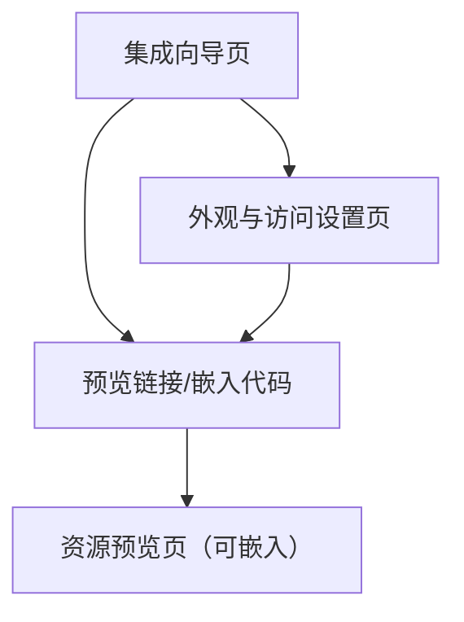

## 1. Product Overview

把“资源（messages）”一键转换为可公开预览的网页，并支持以 iframe/JS SDK 方式嵌入到任意网站。
同时支持两种数据源：离线 messages URL（静态可访问 URL）与在线 API（按资源 ID 动态拉取）。

## 2. Core Features

### 2.1 User Roles

本组件面向“集成方开发者/运营人员”使用，无需强制区分多角色。

### 2.2 Feature Module

本产品最小可用版本包含以下页面：

1. **集成向导页**：选择模式（离线 URL / 在线 API）、填写参数、生成预览链接与嵌入代码、在线测试。
2. **资源预览页（可嵌入）**：渲染资源内容、加载与错误态、基础交互（分页/展开/下载等按内容类型）。
3. **外观与访问设置页**：配置主题与布局、配置访问控制（可选）、查看集成说明摘要。

### 2.3 Page Details

| Page Name  | Module Name | Feature description                                                           |
| ---------- | ----------- | ----------------------------------------------------------------------------- |
| 集成向导页      | 模式选择        | 选择“离线 messages URL”或“在线 API”。                                                 |
| 集成向导页      | 参数配置        | 填写 messagesUrl（离线）或 apiEndpoint+resourceId（在线）；可选填写请求头/令牌占位符（不存储密钥）。          |
| 集成向导页      | 预览链接生成      | 生成可访问的预览 URL（包含必要参数或短 token）；支持复制分享链接。                                        |
| 集成向导页      | 嵌入代码生成      | 生成 iframe 代码与 JS SDK 示例；支持切换宽高、响应式、主题参数。                                      |
| 集成向导页      | 在线测试        | 在页面内嵌一个预览 iframe/SDK 容器，快速验证加载、CORS 与渲染效果。                                    |
| 资源预览页（可嵌入） | 数据获取        | 根据 mode 加载 messages：离线直接 GET messagesUrl；在线请求 apiEndpoint 获取指定 resourceId 数据。 |
| 资源预览页（可嵌入） | 内容渲染        | 将 messages 渲染为可阅读预览（文本、图片、文件链接等）；支持长内容折叠与复制。                                  |
| 资源预览页（可嵌入） | 状态处理        | 展示 skeleton/loading、空态、错误态（网络/CORS/鉴权/格式不合法）；提供重试。                            |
| 资源预览页（可嵌入） | 嵌入适配        | 支持 iframe 自适应高度（postMessage）；支持禁用站内跳转与外链安全打开。                                 |
| 外观与访问设置页   | 主题配置        | 配置品牌色/字体/卡片样式/暗色模式（默认跟随系统）；保存为可复用配置。                                          |
| 外观与访问设置页   | 访问策略（可选）    | 设置分享有效期、一次性 token、允许的嵌入域名白名单（用于提示与前端校验）。                                      |
| 外观与访问设置页   | 集成摘要        | 展示当前配置的“对外接口要求”“CORS/缓存建议”“示例代码”摘要便于复制。                                       |

## 3. Core Process

* 离线 messages URL 流程：你在集成向导页选择“离线”，粘贴 messagesUrl → 生成预览 URL/嵌入代码 → 在自己网站以 iframe/SDK 嵌入 → 预览页直接拉取 messagesUrl 并渲染。

* 在线 API 流程：你在集成向导页选择“在线 API”，填写 apiEndpoint 与 resourceId（以及可选的鉴权参数传入方式）→ 生成预览 URL/嵌入代码 → 预览页按约定调用 API 获取 messages 并渲染。



## 4. 对外集成接口（契约）

### 4.1 嵌入方式

1. iframe 嵌入（推荐最简单）：

* 你使用系统生成的 `previewUrl` 放入 iframe 的 `src`。

* 需要你的网站允许加载该域名；预览页会通过 `postMessage` 回传高度用于自适应。

1. JS SDK 嵌入（推荐需要传鉴权/动态参数）：

* 你在宿主页面通过 SDK 初始化，把 `messagesUrl` 或 `api` 参数在运行时传入，避免把敏感信息写入 URL。

### 4.2 离线 messages URL 规范（你需要提供）

* Method：`GET`

* 响应：`200 application/json; charset=utf-8`

* CORS：至少允许预览页域名 `GET` 访问（或你自行同源部署）。

* 缓存建议：支持 `ETag`/`Last-Modified` 或 `Cache-Control`，便于预览页做增量与离线缓存。

JSON（最小字段，允许扩展）：

```json
{
  "resourceId": "string",
  "title": "string",
  "messages": [
    {
      "id": "string",
      "type": "text|image|file|link",
      "text": "string",
      "url": "https://...",
      "mime": "string",
      "createdAt": "2026-01-01T00:00:00Z"
    }
  ]
}
```

### 4.3 在线 API 规范（你需要提供）

* Endpoint（示例）：`GET {apiEndpoint}/resources/{resourceId}/messages`

* Auth（示例）：`Authorization: Bearer <token>`（token 由你在宿主侧注入；本产品不持久化存储密钥）

* 响应 JSON：同 4.2。

### 4.4 预览 URL（本产品对外）

* 形式示例：`https://<viewer-host>/preview?mode=offline&messagesUrl=...` 或 `.../preview?mode=api&apiEndpoint=...&resourceId=...`

* 约束：不建议把长期密钥放入 query；需密钥时使用 JS SDK 或你自建后端代理。

## 5. 非功能需求（NFR）

* 性能：首屏渲染 < 2s（常见资源）；支持分页/虚拟列表处理大 messages。

* 可靠性：网络失败可重试；对不合法数据做容错与明确报错。

* 安全：默认防 XSS（富文本白名单/纯文本渲染）；外链 `rel="noopener noreferrer"`；iframe 通信限定 origin。

* 隐私：不在客户端持久化保存你的密钥；日志不记录完整 token/URL 查询敏感参数。

* 兼容性：桌面优先；兼容 Chrome/Edge/Safari 最新两大版本。

* 可观测性：暴露基础事件（加载成功/失败/耗时）供你在宿主侧埋点。

