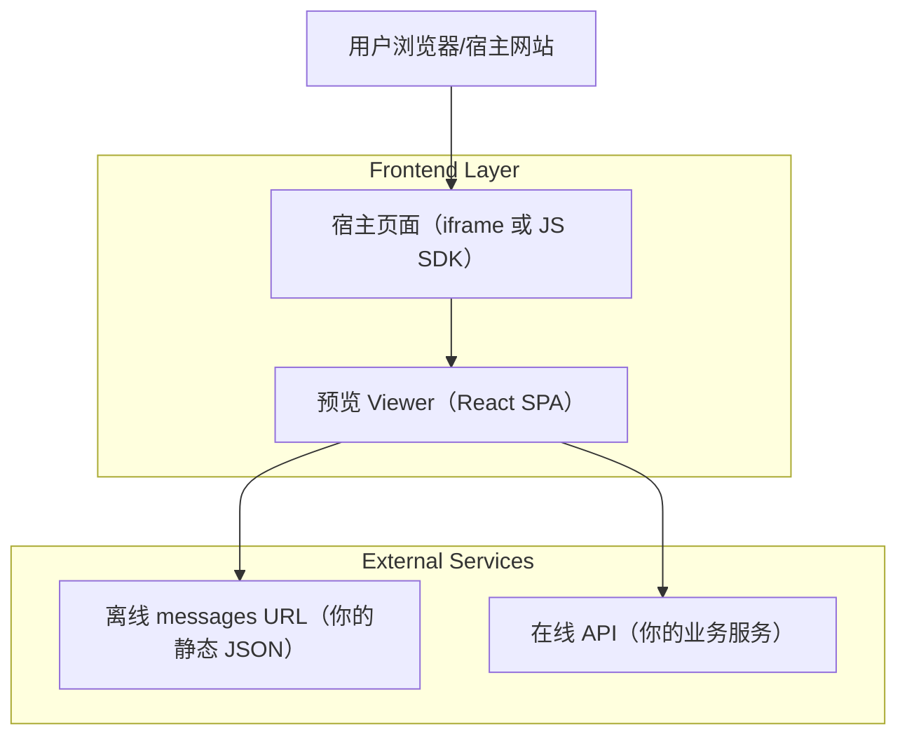

## 1.Architecture design


> 说明：默认不引入自建后端；Viewer 直接在浏览器端拉取数据。若在线 API 需要隐藏密钥，可选引入“你的后端代理”或“Serverless Function”作为安全代理层（不在本最小架构内强依赖）。

## 2.Technology Description
- Frontend: React@18 + TypeScript + vite
- Backend: None（可选：Serverless proxy 用于安全鉴权与签名）

## 3.Route definitions
| Route | Purpose |
|---|---|
| / | 集成向导页：选择模式、配置参数、生成预览/嵌入代码、在线测试 |
| /preview | 资源预览页（可嵌入）：按 query 或 SDK 注入参数拉取并渲染 |
| /settings | 外观与访问设置：主题配置、访问策略提示、集成摘要 |

## 4.API definitions (If it includes backend services)
本产品默认无自建后端 API。对外集成主要依赖你提供的两类数据接口（离线 URL / 在线 API），以及本产品提供的 JS SDK 接口。

### 4.1 共享数据类型（TypeScript）
```ts
export type MessageType = "text" | "image" | "file" | "link";

export type PreviewMessage = {
  id: string;
  type: MessageType;
  text?: string;
  url?: string;
  mime?: string;
  createdAt?: string; // ISO
};

export type PreviewPayload = {
  resourceId: string;
  title?: string;
  messages: PreviewMessage[];
};

export type OfflineSource = {
  mode: "offline";
  messagesUrl: string;
};

export type ApiSource = {
  mode: "api";
  apiEndpoint: string; // e.g. https://api.example.com
  resourceId: string;
  headers?: Record<string, string>; // 运行时注入，不建议落到 URL
};

export type ThemeConfig = {
  brandColor?: string;
  fontFamily?: string;
  darkMode?: "system" | "light" | "dark";
  density?: "comfortable" | "compact";
};
```

### 4.2 JS SDK 对外接口（建议）
```ts
export type EmbedInitOptions = {
  container: HTMLElement;
  source: OfflineSource | ApiSource;
  theme?: ThemeConfig;
  onEvent?: (e: { type: "load" | "error" | "timing"; detail?: any }) => void;
};

export function createPreviewEmbed(opts: EmbedInitOptions): {
  destroy: () => void;
  reload: () => void;
};
```

## 5.Server architecture diagram (If it includes backend services)
不适用（默认无后端）。

## 6.Data model(if applicable)
不强制需要数据库。

- 若你希望生成“短链接 token”（避免超长 query、支持有效期/撤销），可选引入 Supabase：
  - 表：preview_pages(token, mode, source_json, theme_json, expires_at, created_at)
  - Viewer 通过 token 拉取配置后再请求外部 messages/API。
