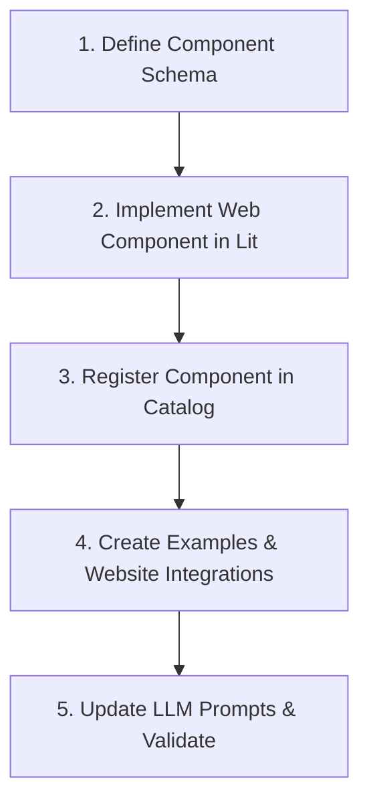

# Developer Guide: How to Add a Custom Component in A2Learn

This guide explains step-by-step how to design, register, implement, and verify a new custom component in the A2Learn platform.

---

## Workflow Overview

To add a new component (e.g., `MentalModel`), follow these 5 steps:



---

## Detailed Steps

### Step 1: Define the Component Schema in `api.ts`
All component schemas and types are defined using Zod inside the component API registry.

1. Open [api.ts](file:///Users/frank/github_project/A2Learn/packages/a2learn-catalog/api.ts).
2. Define your component API schema and export it. It must satisfy the `ComponentApi` interface. For example, for a `MentalModel` component:

```typescript
export const MentalModelApi = {
  name: "MentalModel",
  schema: z
    .object({
      ...CommonProps,
      title: DynamicStringSchema.describe("心智模型名称，例如 'MVC 架构' 或 'Event Loop'"),
      description: DynamicStringSchema.describe("高层次的整体心智模型描述（支持 Markdown）"),
      icon: DynamicStringSchema.optional().describe("心智模型图标 (Emoji)"),
      analogy: DynamicStringSchema.optional().describe("生活中的生动类比，帮助建立直觉（支持 Markdown）"),
      diagram: DynamicStringSchema.optional().describe("结构/流程示意图，例如文本流程或 ASCII Art"),
      pillars: z
        .array(
          z.object({
            title: DynamicStringSchema.describe("要素名称"),
            description: DynamicStringSchema.describe("要素描述"),
            icon: DynamicStringSchema.optional().describe("要素图标 (Emoji)"),
          })
        )
        .optional()
        .describe("该心智模型的几个核心要素"),
    })
    .strict(),
} satisfies ComponentApi;
```

---

### Step 2: Implement the Web Component using Lit
Create the frontend rendering logic using the Lit framework.

1. Create a new TypeScript file under [packages/a2learn-catalog/components/](file:///Users/frank/github_project/A2Learn/packages/a2learn-catalog/components/), e.g., `MentalModel.ts`.
2. Inherit from `A2uiLitElement` and import the schema you just defined.
3. Structure your component with styles (`static styles`) and template (`render()`):

```typescript
import { html, css, nothing } from "lit";
import { A2uiLitElement, A2uiController } from "@a2ui/lit/v0_9";
import { MentalModelApi } from "../api";
import { unsafeHTML } from "lit/directives/unsafe-html.js";
import { sanitizeHtml } from "./sanitize";

export class A2learnMentalModelElement extends A2uiLitElement<typeof MentalModelApi> {
  static styles = css`
    :host {
      display: block;
      margin: var(--a2ui-spacing-l, 20px) 0;
    }
    .container {
      border: 1px solid var(--a2ui-color-border);
      border-radius: var(--a2ui-border-radius);
      background: var(--a2ui-color-surface);
    }
    /* Add custom design styles here */
  `;

  protected createController() {
    return new A2uiController(this, MentalModelApi);
  }

  render() {
    const props = (this as any).controller?.props;
    if (!props) return nothing;

    return html`
      <div class="container">
        <h2>${props.title}</h2>
        <p>${props.description}</p>
      </div>
    `;
  }
}

if (!customElements.get("a2learn-mental-model")) {
  customElements.define("a2learn-mental-model", A2learnMentalModelElement as any);
}

export const A2learnMentalModel = {
  ...MentalModelApi,
  tagName: "a2learn-mental-model",
};
```

---

### Step 3: Register the Component in the Catalog
To make the component available to the viewer, import and register it in the catalog index.

1. Open [index.ts](file:///Users/frank/github_project/A2Learn/packages/a2learn-catalog/index.ts).
2. Import the component definition (`A2learnMentalModel`).
3. Add it to the components array in `a2learnCatalog`.

```typescript
export const a2learnCatalog = new Catalog<LitComponentApi>(
  "https://a2learn.ai/spec/v1/catalog.json",
  [
    // ... other components
    A2learnMentalModel,
  ],
  basicCatalog?.functions ? Array.from(basicCatalog.functions.values()) : []
);
```

---

### Step 4: Create Examples & Website Integrations
We provide mock examples for developers to visualize components inside the viewer and for regression testing.

1. **Component-level examples**:
   - Create directories under `packages/a2learn-catalog/examples/Component/[ComponentName]/`.
   - Add `basic.json` and `advanced.json` files illustrating standard and advanced usage wrapped with `{ "literalString": ... }` values.
2. **Website-level examples**:
   - Integrate the component into mock website layouts like `agent-react.json`, `js-async.json`, etc., in [packages/a2learn-catalog/examples/Website/](file:///Users/frank/github_project/A2Learn/packages/a2learn-catalog/examples/Website/).

---

### Step 5: Update LLM Prompts & Validate
In order for the AI Agent to know when and how to generate the new component, update the prompts:

1. **For Agent Loop Mode**:
   - Open [llm.py](file:///Users/frank/github_project/A2Learn/agent/llm.py).
   - Add your component to the `recommendedComponents` list inside `build_site_plan` and `generate_a2ui_messages`.
   - Add prompt guidelines to explain to the LLM when to prefer the new component.
2. **For Parser Mode**:
   - Open [parser_mode_prompt.txt](file:///Users/frank/github_project/A2Learn/skill/prompts/parser_mode_prompt.txt).
   - Add the component schema field to the JSON schema list.
   - Update [parser.py](file:///Users/frank/github_project/A2Learn/agent/parser.py) to parse this property and generate the A2UI message mapping.
3. Run testing and validation commands:
   - **Build**: Compile TypeScript by running `npm run build` at the root.
   - **Test**: Run Python unit tests verifying messages structure validation:
     ```bash
     PYTHONPATH=. pytest tests
     ```
