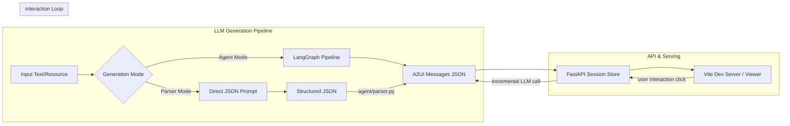

# Developer Guide: System Architecture

A2Learn is composed of a Python-based generation backend and a React/Lit-based frontend renderer. This document details the system design, the two generation pipelines, and the interactive session architecture.

---

## 1. High-Level Architecture Overview



The system is split into three main packages:
- **`agent/`**: The core Python package managing content generation, LLM connection, and A2UI message mapping/validation.
- **`apps/api/`**: The FastAPI server that handles interactive session states and returns incremental message updates during user actions.
- **`apps/viewer/`**: The frontend React app which processes A2UI message streams and mounts Lit Web Components representing the educational interface.
- **`packages/a2learn-catalog/`**: Defines Zod schemas and Lit templates for custom showcase elements (e.g. `ConceptCard`, `MentalModel`, `InteractiveSandbox`).

---

## 2. Generation Pipelines

A2Learn provides two generation modes to convert raw knowledge resources into interactive UI messages.

### 2.1 Agent Loop Mode (LangGraph-based)
This mode runs as a linear LangGraph state chart:

```
[init_output] -> [load_resource] -> [plan_curriculum] -> [build_site] -> [generate_messages] -> [export_messages]
```

1. **`plan_curriculum`**: Calls the LLM to outline the course modules, key concepts, goals, and activities. Generates `curriculum.json`.
2. **`build_site`**: Translates the curriculum into a flat site structure, recommending specific A2UI components for each surface/page. Generates `site.json`.
3. **`generate_messages`**: Generates full A2UI v0.9 compliant component messages, linking elements together under a root column layout. Generates `site_messages.json`.

### 2.2 Parser Mode (Direct JSON + Python mapping)
Instead of running a multi-step agent pipeline, Parser Mode optimizes for speed and stability by performing generation in a single LLM pass.
1. The LLM is prompted with `skill/prompts/parser_mode_prompt.txt`.
2. The LLM outputs a simplified, structured course content JSON representation (saving it to `course_content.json`).
3. [parser.py](file:///Users/frank/github_project/A2Learn/agent/parser.py) reads this content JSON and maps its properties programmatically into standard A2UI messages (saving the result as `site_messages.json`).

---

## 3. Interaction Loop & Session Store

When operating in **Online Mode**, user actions (e.g. selecting a step in a `LearningPath` or clicking a `DeepDivePrompt` choice) are processed in real-time.

1. The frontend Viewer captures the action and sends the payload to `/api/session/{session_id}/action`.
2. The FastAPI backend fetches the current session state from the `SessionStore`.
3. The backend builds a prompt containing:
   - The user action payload.
   - The current component state.
   - All other active surface IDs in the layout.
4. The backend calls the LLM to generate **incremental** message updates (`updateComponents` payload only).
5. The frontend receives the updates and merges them into the current state without refreshing the page.

---

## 4. Inline JIT (Just-In-Time) Course Expansion

To prevent large-context overhead, A2Learn implements an accordion-like nesting mechanism:
- The agent initially renders a course syllabus component (`CourseOutline`) with locked or placeholder module states.
- When the user selects a module, the frontend fires `onModuleSelect` back to the backend.
- The agent generates the specific cards (quizzes, explanations, sandboxes) for that specific module JIT.
- The A2UI engine mounts the generated cards inside the sub-module container, creating an expanding, seamless waterfall experience.
